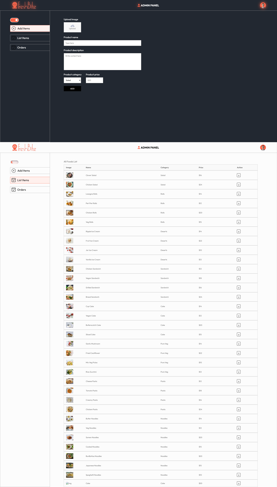

# FreshBite - Food Delivery Website

FreshBite is a full-stack MERN (MongoDB, Express, React, Node.js) application designed for food delivery. It includes an admin panel for managing food items, orders, and categories, as well as a user-facing frontend for browsing menus, placing orders, and tracking them.

---
## Screenshots

### Admin Panel

### User Frontend

---

## Table of Contents

- [Features](#features)
- [Tech Stack](#tech-stack)
- [Project Structure](#project-structure)
- [Setup Instructions](#setup-instructions)
- [Usage](#usage)
- [API Endpoints](#api-endpoints)
- [License](#license)

---

## Features

### Admin Panel
- Add, update, and delete food items.
- View and manage orders.
- Toggle between light and dark themes.

### User Frontend
- Browse food menus by category.
- Add items to the cart and place orders.
- Track order status.
- User authentication (login and registration).
- Responsive design for mobile and desktop.

---

## Tech Stack

### Frontend
- React.js
- Vite.js
- React Router
- Axios
- React Toastify
- CSS Modules

### Backend
- Node.js
- Express.js
- MongoDB (Mongoose)
- Multer (for file uploads)
- Stripe (for payment integration)
- JWT (for authentication)

---

## Project Structure
Food_Del/ ├── LICENSE ├── README.md ├── admin/ # Admin panel │ ├── public/ # Static assets │ ├── src/ # Source code │ ├── package.json # Admin dependencies │ └── vite.config.js # Vite configuration ├── frontend/ # User-facing frontend │ ├── public/ # Static assets │ ├── src/ # Source code │ ├── package.json # Frontend dependencies │ └── vite.config.js # Vite configuration ├── backend/ # Backend server │ ├── config/ # Database configuration │ ├── controllers/ # API controllers │ ├── models/ # Mongoose models │ ├── routes/ # API routes │ ├── uploads/ # Uploaded images │ ├── server.js # Main server file │ └── package.json # Backend dependencies └── .anima/ # Cache and other files

---

## Setup Instructions

### Prerequisites
- Node.js (v16 or higher)
- MongoDB (local or cloud instance)
- Vite.js (for frontend and admin)

## 2.Install dependencies for each module:
### Backend
cd backend
`npm install`

### Admin Panel
cd ../admin
`npm install`

### Frontend
cd ../frontend
`npm install`

## 3.Configure environment variables:

Create a .env file in the backend directory with the following:
- `MONGO_URI`=your-mongodb-connection-string
- `JWT_SECRET`=your-jwt-secret
- `STRIPE_SECRET_KEY`=your-stripe-secret-key

## 4.Start the development servers:

### Backend
cd backend
`npm run server`

### Admin Panel
cd ../admin
`npm run dev`

### Frontend
cd ../frontend
`npm run dev`

## 5.Access the application:

- Admin Panel: http://localhost:5173
- Frontend: http://localhost:5173

## Usage
### Admin Panel
- 1.Navigate to the admin panel URL.
- 2.Add, update, or delete food items.
- 3.Manage orders and view customer details.
### User Frontend
- 1.Browse the menu and add items to the cart.
- 2.Proceed to checkout and place an order.
- 3.Track your order status in the "My Orders" section.

## 

## API Endpoints

### User Routes
- `POST /api/user/register` - Register a new user.
- `POST /api/user/login` - Login a user.
- `GET /api/user/profile` - Get user profile.

### Food Routes
- `POST /api/food/add` - Add a new food item.
- `GET /api/food/list` - Get all food items.
- `POST /api/food/remove` - Remove a food item.

### Order Routes
- `POST /api/order/place` - Place a new order.
- `POST /api/order/verify` - Verify payment.
- `POST /api/order/userorders` - Get user orders.
- `GET /api/order/list` - Get all orders (admin).

### Cart Routes
- `POST /api/cart/add` - Add item to cart.
- `POST /api/cart/remove` - Remove item from cart.
- `POST /api/cart/get` - Get cart data.

---

## License

This project is licensed under the [MIT License](LICENSE).

## Contributors

- **Rupeshkumar** - Developer
